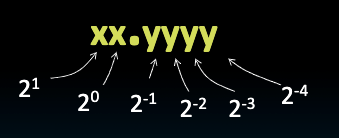
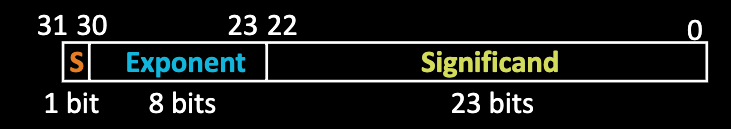
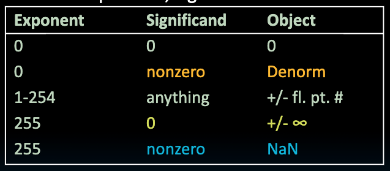

# Floating Point

## Why do we need Floating Point?

If we want to represent a number like $1.5$ we would need to use floating point. 
But how do we represent floating point numbers in Binary?

## Representation of Fractions

### Example 6-bit representation

- $10.1010_2 = 1 \times 2^1 + 1 \times 2^{-1} + 1 \times 2^{-3} = 1.626_{10}$

## Floating Point Representation

We use $32$ bits to represent the floating point number in scientific notiaton

- Bit 31 = Sign (1 bit)
- Bit 30 - 23 = Exponent (8 bits)
- Bit 22 - 0 = Significand (23 bits)
- Represent numbers as small as $1.2 \times 10^{-38}$ to as large as $3.4 \times 10^{38}$

What if a result is too large?
- Overflow -> exponent larger than reprsented in 8-bit exponent field

What if a result is too small?
- Underflow -> Negatiev exponenet larger than represented in 8-bit exponenet field

### Example

Convert `0x80000000` with the 6 bit exponenet representation to decimal 

- `0x80000000` = `1 000000 0000...0`
- Sign : negative
- Exponenet: -30 (denormalized) as in all 0s for exponent
- Value = $-2^{-30} * (0.000...0) = -0$

Convert `0x53530000` to decimal

- `0x53530000` = `0 101001 1010100110...0`
- Sign: positive
- Exponenet: $41 - 31 = 10$
- Value = $2^{10} * (1.101010011) = 1702$

## Special Numbers

